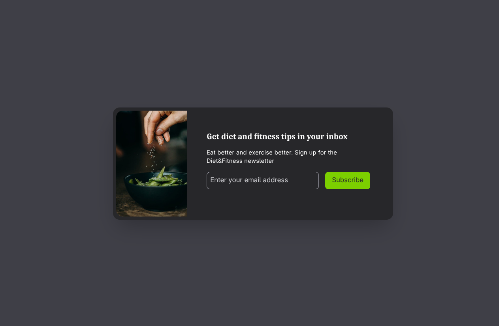

# 🚀 Tailwind CSS Mini Projects: The Architect's Journey

Welcome to my portfolio of high-end, responsive components built with a "Performance-First" mindset. This repository documents my progression through real-world UI challenges, bridging the gap between foundational utility patterns and the future of web architecture.

## 📚 Course Reference

I am following the comprehensive course by Brad Traversy:

- **Course Name:** [Tailwind CSS From Scratch | Learn By Building Projects](https://www.udemy.com/course/tailwind-from-scratch/)
- **Instructor:** Brad Traversy
- **Focus:** Building real-world projects while mastering core utility classes and modern v4 features.

---

## 🏗️ Project Timeline & Learning Logs

### 📧 Project 1: Email Subscribe Card
*Focus: Background Patterns and Container-Aware Components.*

- **Symmetry & Balance:** Aligning content within a flex-container while maintaining typography hierarchy.
- **Variable-First Design:** Transitioned from inline classes to custom `@theme` variables for brand identity.
- **Container Queries:** Implemented `@container` logic to make the component portable across any layout width.

#### 📸 Preview

### 💎 Project 2: Pricing Cards
*Focus: Visual Hierarchy, 3D Layering, and Resilient Design Tokens.*

- **Visual Psychology:** Learned the "Z-Index Lift" strategy, using `scale-105` and `z-10` to break the 2D plane and guide user decision-making.
- **Resilient Theme Design:** Implemented opacity-based borders (`border-slate-600/50`) to ensure UI adaptability across different background environments.
- **Micro-Typography:** Leveraged `uppercase` and `tracking-widest` to create professional, senior-level card headers.

#### 📸 Preview

### 🛍️ Project 3: Product Modal
*Focus: Interface Friction, Chromatic Contrast, and Semantic Symmetry.*

- **Friction Engineering:** Mastered the concepts of "Low Friction" vs "High Friction" UI. Used solid color blocks for primary destinations and hollow outlines for secondary utilities.
- **Chromatic Atmosphere:** Switched from neutral gray shadows to "Glowing Shadows" using `shadow-blue-200` to enhance brand energy.
- **Typography Scarcity:** Applied italicized micro-copy to simulate motion and urgency in stock-limited offers.
- **Symmetry Control:** Utilized `flex-1` across split-layout containers to ensure a mathematically perfect 50/50 distribution of visual weight.

#### 📸 Preview

### 🖼️ Project 4: Image Gallery
*Focus: Progressive Disclosure, Optical Bleeding, and Grid Stability.*

- **Progressive Disclosure:** Built a minimalist search interface that "awakens" only on interaction (`group-focus-within`), prioritizing visual content over UI chrome.
- **Optical Bleeding:** Replaced solid overlays with alpha-blended gradients (`bg-gradient-to-t`) to ensure text legibility while maintaining image immersion.
- **Grid Stability:** Enforced strict `aspect-[4/3]` constraints combined with `object-cover` to create a professional, uniform masonry-style layout regardless of source image dimensions.
- **Micro-Rewards:** Engineered a dual-feedback hover state (zoom + slide-up menu) to create a playful "Discovery Loop" for the user.

#### 📸 Preview

### 🔐 Project 5: Login Modal
*Focus: Visual Anchoring, Atmospheric Brand Aura, and Glassmorphism.*

- **Visual Anchoring:** Implemented a Serif-headed typography stack (`font-serif`) to establish a traditional, high-trust "Authority Point" for secure authentication.
- **Atmospheric Zoning:** Orchestrated a 50/50 split layout that hides environmental visuals on mobile (`md:block`) while maintaining brand aura on desktop.
- **Glassmorphic Interactivity:** Applied `backdrop-blur-sm` to secondary control elements to ensure legibility across complex oceanic visual backgrounds.
- **Success Path Engineering:** Leveraged high-contrast chromatic differentials between primary actions and secondary "safety nets" (Forgot password) to optimize conversion flow.

#### 📸 Preview

---

## ⚡ Architectural Deep Dive: Atmospheric Experience

In Project 5, we moved beyond utility into **Environmental Brand Engineering**:

1.  **Luxe Padding:** Embraced "Negative Space" (`p-16`) to create a spacious, premium feel that reduces user "Input Anxiety" during sensitive data entry.
2.  **Noise Reduction:** Specifically engineered a "Loudness Hierarchy" by quietening instructional micro-copy (`text-slate-400`) once the context was established, letting the **Primary Action** dominate the screen.
3.  **Constraint-Aware Buttons:** Transitioned from `w-full` mobile buttons to `w-auto` desktop buttons to maintain component elegance across disparate device viewports.

---

## ⚡ Architectural Deep Dive: Discovery Systems

In Project 4, we moved into **Multi-Item Orchestration**:

1.  **Constraint as Luxury:** We learned that forcing images into a shared aspect ratio (`4/3`) isn't a limitation—it's a hallmark of premium design. It replaces visual chaos with rhythmic stability.
2.  **State-Aware Icons:** Utilized `group-focus-within` to create a visual bridge between the input and the search icon, making the header feel like a single reactive unit.
3.  **CSS Internal Logic:** Used the `invert` utility to dynamically theme SVG assets without modifying the source files—a key strategy for rapid development in v4.

---

## ⚡ Architectural Deep Dive: Visual Psychology

In Project 2, we moved beyond just "adding colors" and started engineering the **User's Eye Path**:

1.  **Breaking the Plane:** By scaling the middle card and adjusting its `z-index`, we force the browser to treat it as a separate layer. This mimics real-world physical objects, making the "Standard" plan feel more tangible.
2.  **Harmonious Sizing:** In Tailwind v4, spacing values are mathematically derived. Using `gap-6` and `p-8` ensures that the "White Space" feels intentional and balanced across all screen sizes.
3.  **Dynamic Transparency:** Using colors like `purple-400/30` means your design isn't "Hardcoded." It's "Reactive"—it inherits the light and dark of the environment it lives in.

---

## ⚡ Architectural Deep Dive: Interface Friction

In Project 3, we transitioned from "making it look good" to **Engineering the User's Reflexes**:

1.  **Fitts's Law in Action:** By maximizing the blue "Add to Cart" button, we created a high-probability target. This is "Low Friction" design—the user converts without searching.
2.  **Cognitive Gaps:** The "Wishlist" and "Compare" buttons are intentional "High Friction" points. They require deliberate focus, ensuring that secondary actions don't distract from the primary revenue goal.
3.  **Color Temperature:** We learned that shadows are not just "darkness"—they are reflections. Using blue-tinted shadows on a blue button creates a cohesive atmospheric glow that feels premium and native.

---

## ⚡ Architectural Deep Dive: The Directives

Before starting the projects, we deconstructed the "Language of Tailwind" to understand how it communicates with the browser. 

| Directive | v3 Logic (The Course) | v4 Efficiency (The Reality) |
| :--- | :--- | :--- |
| **Setup** | `@tailwind base / util;` | `@import "tailwindcss";` (Unified) |
| **Bundling** | `@apply rounded-xl p-4;` | `var(--radius-xl);` (Standard CSS) |
| **Access** | `theme('spacing.4')` | `var(--spacing-4)` (Native Variables) |
| **Logic** | `module.exports` (JS) | `@theme` (CSS-First) |
| **Conditions** | `.dark` / `@media` | `@variant dark / md` |

### 🔍 Key Learning: Design Tokens are Variables
In v4, Tailwind has dropped the "Magic Bridge" (JavaScript configuration) for its core design tokens. 
- **Tokens as Constants:** Every design token (colors, spacing, radius) now exists as a **Native CSS Custom Property**.
- **Transparency:** This allows for real-time debugging in the browser inspector and dynamic modification via JavaScript—a "Senior Standard" for modern web engineering.

---
